# 🧘 HealYoga

HealYoga is a Flutter-based mobile wellness application designed to encourage regular yoga practice through guided sessions, calming music, and progress tracking.  
The app focuses on accessibility and simplicity, making it suitable for beginners, working adults, and elderly users.

---

## ✨ Features

- 🧘 Guided yoga sessions (Beginner, Intermediate, Advanced)
- 🎵 Calming music and white-noise support
- 📊 Progress tracking (sessions completed, time practiced)
- 🔐 User authentication (Google / Email / Social login)
- 👤 Personal user profiles
- 🔔 Gentle reminders and notifications
- ♿ Accessibility-focused UI (readable fonts, simple navigation)

---

## 🛠 Tech Stack

- **Frontend:** Flutter (Dart)
- **Backend:** Supabase (PostgreSQL, Auth, REST API)
- **Authentication:** Supabase Auth
- **State Management:** (add if used, e.g. Provider / Riverpod)
- **Platform:** Android (Web / iOS – if applicable)

---

## 🚀 Deployment Process

HealYoga is currently in the development and testing phase.

1. Developers clone the repository and run the app locally during development.
2. A release APK is generated using:
```bash
flutter build apk
```
3. The generated APK (app-release.apk) is used for internal testing,
demonstrations, and evaluation purposes.

4. The application has not been published to the Google Play Store yet.

## 1. 🚀 Getting Started

### Prerequisites
Make sure you have the following installed:
- Flutter SDK
- Dart SDK
- Android Studio / VS Code
- Android Emulator or physical device or IOS device

Check setup:
```bash
flutter doctor
```

## 2. 🚀 Installation & Run (For Code Testing)
1. Clone the repository:
```bash
git clone https://github.com/your-username/heal_yoga.git
```
2. Navigate into the project directory:
```bash
cd heal_yoga
```
3. Install dependencies:
```bash
flutter pub get
```
4. Run the application via emulator or web
```bash
flutter run
```

## 3. Installation & Run (For Deployment)
1. Download the apk file from
https://drive.google.com/file/d/1kzjriKISg28ypxwUsrl8vBSdVKIaDSFv/view?usp=sharing
2. Install it via adb while having a emulator or physical phone with you
```bash
adb install {YOURPATH}/app-release.apk
```
(Ensure the terminal is opened in the same folder as the downloaded APK.)


## 4. 📱 Screenshots

| Login | Register |
|-------|----------|
| 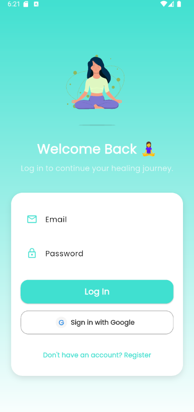 | 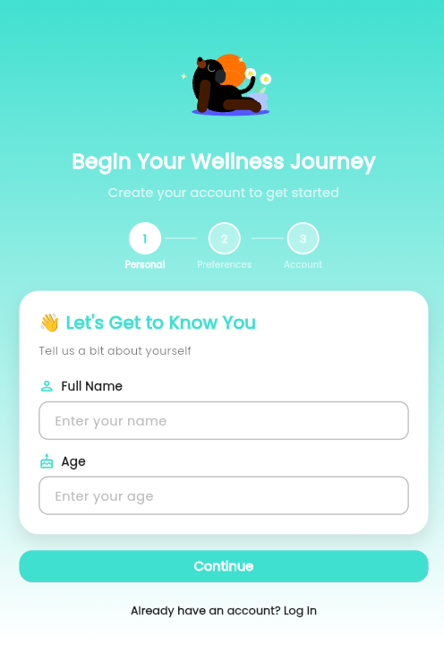 |

**Login Screen**  
Users can sign in to HealYoga using multiple authentication methods, including
Google Sign-In or email and password. This allows returning users to securely
access their personalized yoga sessions, progress records, and profile data.

**Register Screen**  
New users can register for an account using their email address and password.
Once registered, users can log in to the application and begin using all core
features of HealYoga.

---

| Home Screen | Start Workout |
|-------------|----------------|
| 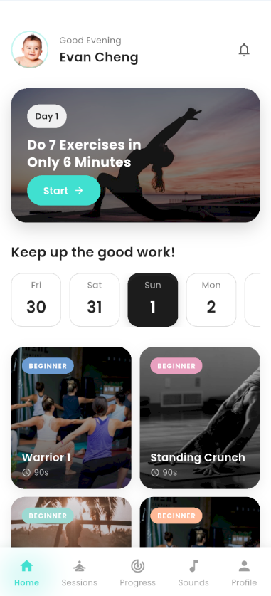 | 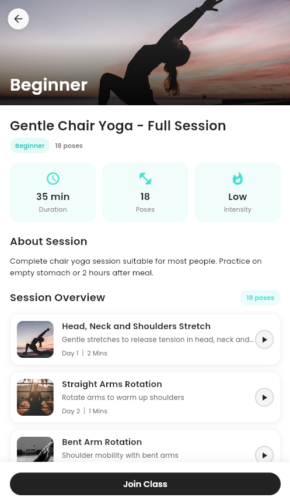 |

**Home Screen**  
The Home Screen serves as the main dashboard of HealYoga, greeting users with
personalized recommendations and daily workout prompts. It highlights quick
start options for beginner-friendly yoga sessions, displays short-duration
workouts to reduce entry barriers, and provides easy navigation to other core
features of the application.

**Start Workout**  
The Start Workout screen allows users to preview a selected yoga session before
beginning the workout. It presents key session details such as difficulty level,
total duration, number of poses, and intensity, along with a brief description
and session overview to help users understand what to expect before joining
the class.


| Sessions | Workout Progress |
|----------|------------------|
| 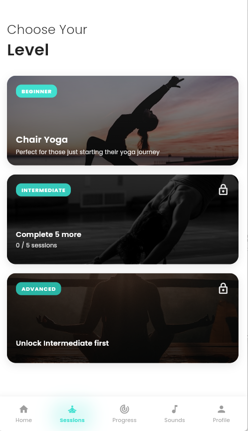 | 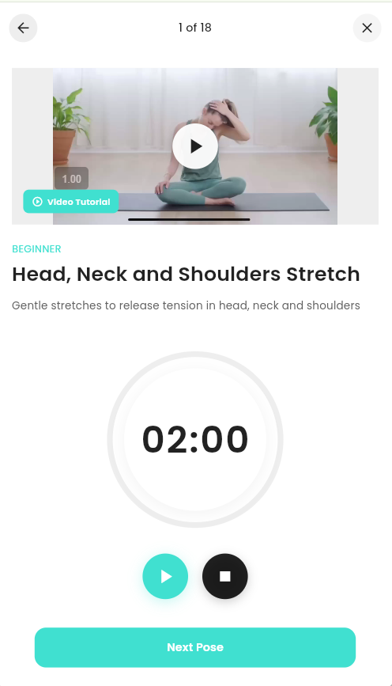 |

**Sessions Screen**  
The Sessions screen displays a structured catalogue of yoga exercises organized
by difficulty level, allowing users to explore and select workouts that match
their experience and physical ability. Each session includes visual previews
and duration information to help users make informed choices before starting
a workout.

**Workout Progress**  
The Workout Progress screen guides users through an active yoga session by
showing real-time exercise progress, timers, and completion indicators. This
screen helps users stay on track during the workout while clearly indicating
current progress and remaining exercises within the session.

| Calming Sounds | Progress Tracking |
|----------------|------------------|
| 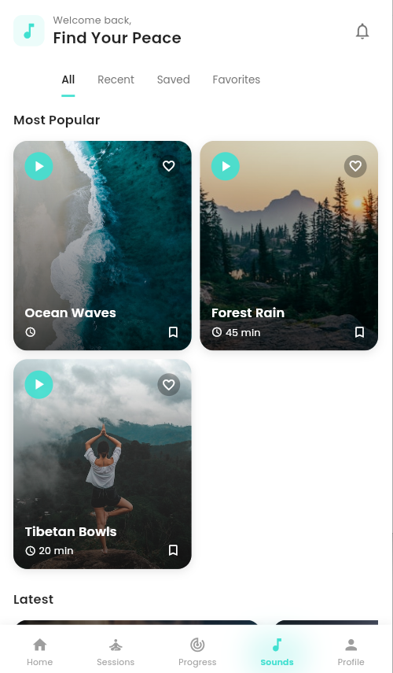 | 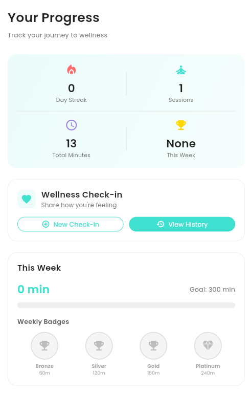<br>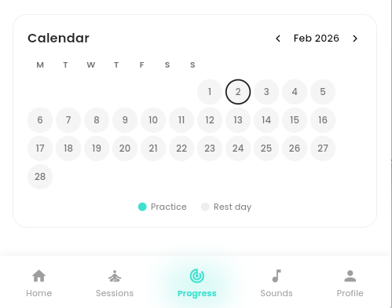 |

**Calming Sounds**  
The Calming Sounds feature provides a curated library of white noise and ambient
audio such as ocean waves, rainfall, and meditation sounds. Users can browse
sounds by category, mark favourites, and play audio independently or in
conjunction with yoga sessions to support relaxation, focus, and stress relief.

**Progress Tracking**  
The Progress Tracking screen presents users with a comprehensive overview of
their wellness journey, including daily streaks, total practice time, completed
sessions, and weekly goals. It also features a wellness check-in function, badge
system, and calendar view to encourage consistency and long-term engagement.

| Profile | Edit Profile |
|---------|--------------|
| 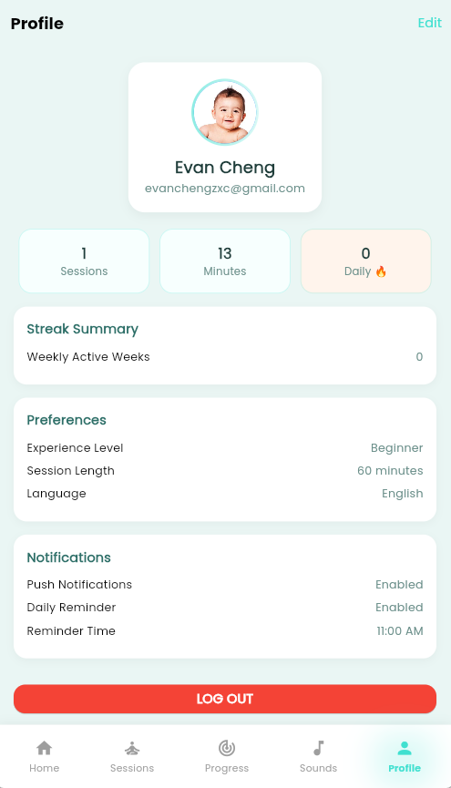 | 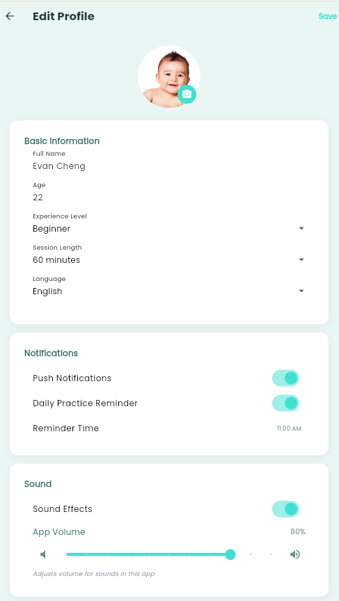 |

**Profile Screen**  
Allows users to view their personal information, preferences, and account
details within the application.

**Edit Profile**  
Enables users to update their profile information and preferences to personalize
their experience within HealYoga.

## 5. 🧭 App Usage Guide

1. **User Authentication**  
   Users begin by registering a new account using their email address or
   logging in using Google Sign-In or email and password.

2. **Home Dashboard**  
   Upon successful login, users are greeted with the Home Screen, which
   provides personalized workout recommendations and quick access to
   beginner-friendly yoga sessions.

3. **Starting a Yoga Session**  
   Users can start a workout directly from the Home Screen or browse
   available sessions by difficulty level. Session details are shown
   before the workout begins.

4. **Workout Guidance**  
   During a session, the app guides users through exercises using timers
   and progress indicators to ensure a smooth and structured experience.

5. **Relaxation and Recovery**  
   Users can access calming sounds such as white noise and ambient audio
   to relax during or after workouts.

6. **Progress Monitoring**  
   Users can track their completed sessions, practice duration, streaks,
   and wellness check-ins through the Progress Tracking feature.

7. **Profile Management**  
   Users can view and update their personal profile and preferences at
   any time via the Profile section.

## 6. 🧪 Testing

- Tested on Android Emulator (Pixel series)
- Tested on physical Android devices
- Tested on Web Version (Phone / PC)
- Manual functional testing conducted on:
  - Authentication
  - Yoga sessions
  - Calming sounds
  - Progress tracking
  - Notifications
 
## 7. ⚠️ Known Limitations & Future Improvements

- The application is currently available for Android devices only for Applications
- iOS users can access the application via the web version.
- Public deployment to the Google Play Store is planned for a future phase.
- Future enhancements may include additional yoga levels, accessibility
  options such as adjustable font sizes, and expanded wellness analytics.


## 8. 👥 Team Members

- Kaam Yan Hye  
- Natalie Narayanan  
- Jocasta Tan  
- Daniel Soong  


## 9. 📄 License

This project was developed for academic purposes as part of the CSC2101
(PSD & Team Project) module.


